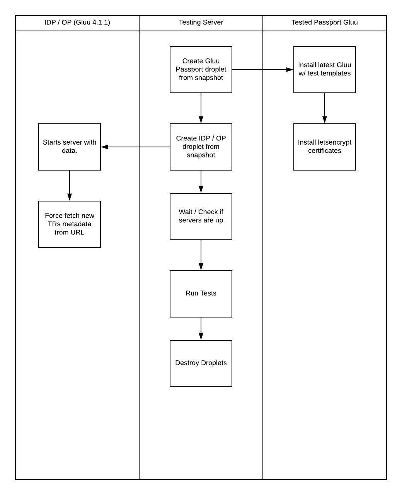
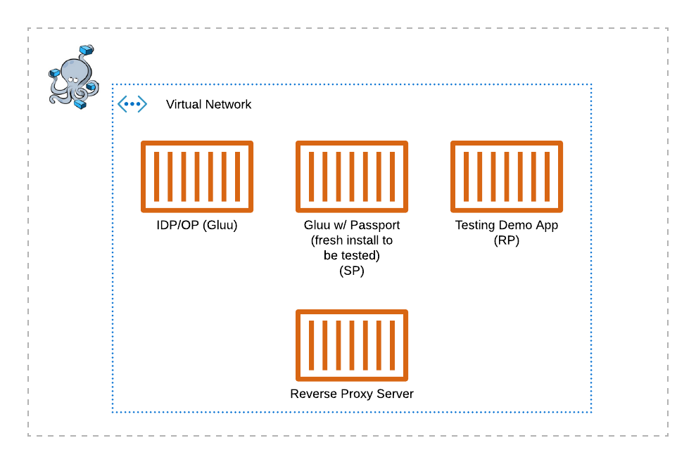

# Gluu-Passport Blackbox Testing

## Goal

- Automate tests for all the passport flows

## How we do it

Creating a **stage** environment like:



## What to do

- Setup OP/IDP server
- Install latest version - Connect to external database
- Create tests users on idp/op server **automated**
- Setup test client **done**

## Setup

- On a fresh droplet, create folder `test-install-data`:

``` sh
ssh <yourhost> mkdir /test-install-data
```

- Copy files from setup folder to `test-install-data` that you just created on your fresh droplet:

```sh
scp -r ./setup/* t1.techno24x7.com:/test-data/.
```

- Run the `prepare.sh` file on your fresh droplet:

```sh
ssh <yourhost> /test-install-data/prepare.sh
```

- Check if flag file was created:

```sh
ssh <yourhost> ls /root
```

### Setup should be done on env.sh file, please check it

## TO BE

### In the near future

This is a nice milestone...

